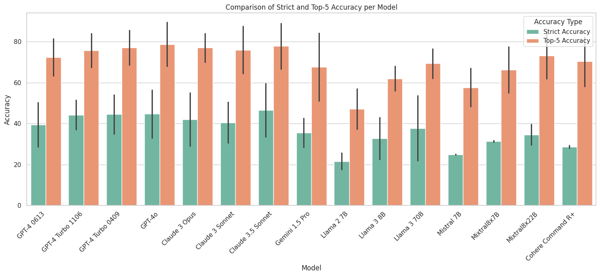

# Evaluation of DxGPT for <u>common and rare diseases</u> across multiple closed & open models

### Intro to this repo

Welcome to our repository dedicated to the evaluation of [DxGPT](https://dxgpt.app/) across various AI models, both for common and rare diseases. 

This project aims to explore the capabilities and limitations of different AI models in diagnosing diseases through synthetic and real-world datasets. Our comprehensive analysis includes closed models like GPT-4o, Claude 3 and 3.5 and open models like Llama 2 and 3, Mistral and Cohere Command R +, providing insights into their diagnostic accuracy and potential applications in healthcare.

In this repository, you will find detailed evaluations, comparisons, and insights derived from multiple AI models. Our goal is to contribute to the advancement of AI in healthcare, specifically in improving diagnostic processes and outcomes for a wide range of diseases. We encourage collaboration, discussion, and feedback to further enhance the understanding and development of AI-driven diagnostics.

Stay tuned for updates and findings as we delve deeper into the world of AI and healthcare.

### Summary plot

In this graph, the green and orange bars correspond respectively to P1 (probability of correctly identifying within the first diagnosis) and P5 (probability of correctly identifying the diagnosis among the top 5 suggestions). 

Furthermore, the black line is the difference in accuracy between common diseases (top) and rare diseases (bottom). 

### Our first paper

Here you can find the first preprint of our work:

[Assessing DxGPT: Diagnosing Rare Diseases with Various Large Language Models](https://www.medrxiv.org/content/10.1101/2024.05.08.24307062v1)

### Next steps

It's crucial to emphasize that DxGPT is still in development and is intended as a decision support tool, not a replacement for professional medical judgment. The tool aims to assist healthcare professionals by generating diagnostic hypotheses based on patient symptoms and clinical data, potentially reducing the time to diagnosis for common and rare diseases. Further validation on real clinical data and comparison with human expert diagnoses are necessary to fully assess its performance and potential impact on patient care. We are also conducting these studies within hospitals and the first results will be published soon. 

### IPynb Dashboard with comparison of multiple models:

## File naming convention

The naming convention of the files in this repository is systematic and provides quick insights into the contents and purpose of each file. Understanding the naming structure will help you navigate and utilize the data effectively.

### Structure

Each file name is composed of four main parts:

1. **Evaluation data prefix**: All files related to model evaluation scores begin with `scores_`. This prefix is a clear indicator that the file contains data from the evaluation 
process. `diagnoses_` prefix is used for the files that contain the actual diagnoses from each test run, same naming convention as the scores files. `synthetic_*` prefix is used for the synthetic datasets.

2. Additionally, the dataset name is included to provide context. Example datasets include:
    - `(empty)` is a gpt4 synthetic dataset
    - `claude` is a claude 2 synthetic dataset
    - `medisearch` is a medisearch synthetic dataset
    - `RAMEDIS` is the RAMEDIS dataset from RareBench 
    - `PUMCH_ADM` is the PUMCH dataset from RareBench
    - `URG_Torre_Dic_200` is our proprietary dataset from common diseases in urgency care.

3. This is followed by the version of the dataset used for the evaluation (`(empty)` is v1, `v2` is the second version of the dataset).

4. **Model identifier**: Following the prefix, the name includes an identifier for the AI model used during the evaluation. Some of the possible model identifiers are:
   - `_gpt4_0613`: Data evaluated using the GPT-4 model checkpoint 0613.
   - `_llama`: Data evaluated using the LLaMA model.
   - `_c3`: Data evaluated using the Claude 3 model.
   - `_mistral`: Data evaluated using the Mistral model.
   - `_geminipro15`: Data evaluated using the Gemini Pro 1.5 model.

### Modifiers

In addition to the main parts, file names may include modifiers that provide further context about the evaluation:

- `_improved`: Indicates that the file contains data from an evaluation using an improved version of the prompt.
- `_rare_only_prompt`: Specifies that the evaluation prompt was a test focused exclusively on rare diseases.

### Examples

- `scores_v2_gpt4_0613.csv`: Evaluation scores from the second version of the dataset using the GPT-4 model checkpoint 0613.
- `scores_medisearch_v2_gpt4turbo1106.csv`: Evaluation scores from the medisearch synthetic dataset using the GPT-4 model turbo checkpoint 1106.
- `scores_URG_Torre_Dic_200_improved_c3sonnet.csv`: Evaluation scores from the urgency care dataset from December using the Claude 3 Sonnet model with an improved prompt.
- `scores_RAMEDIS_cohere_cplus.csv`: Evaluation scores from the RAMEDIS dataset using the Cohere Command R + model.
- `scores_PUMCH_ADM_mistralmoe.csv`: Evaluation scores from the PUMCH dataset using the Mistral MoE 8x7B model.

This structured approach to file naming ensures that each file is easily identifiable and that its contents are self-explanatory based on the name alone.

### Link to the DxGPT free web app:

